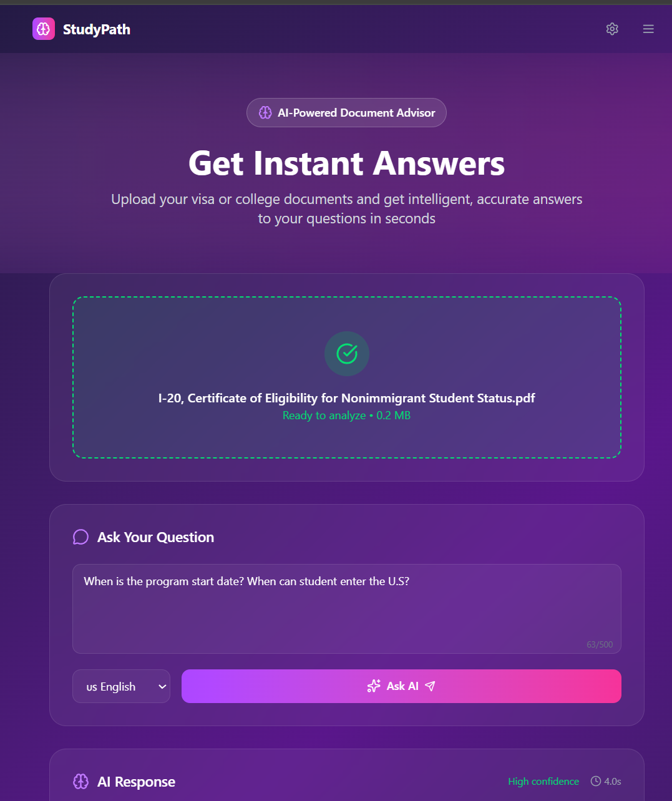
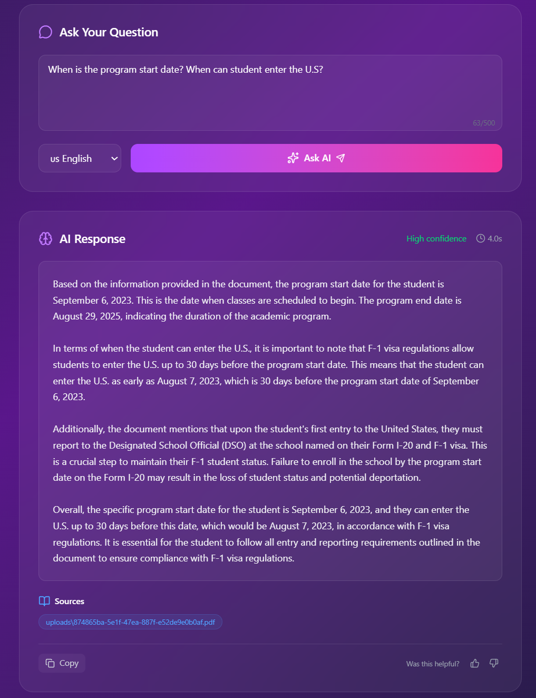

# StudyPath AI-Advisor 🧠📄  
**Intelligent Document Analysis for International Students**

StudyPath is a powerful RAG (Retrieval-Augmented Generation) system that helps international students understand their visa and college documents. Upload your I-20, ask questions in natural language, and get accurate answers that combine document-specific information with expert knowledge of F-1 visa regulations.



---

## ✨ Key Features

- 📄 **Smart Document Processing**: Handles both digital and scanned PDFs with OCR fallback
- 🧠 **Hybrid Intelligence**: Combines document content with F-1 visa regulatory knowledge  
- 🌍 **Multilingual Support**: Ask questions in English, Spanish, or Chinese
- ⚡ **Instant Answers**: Get comprehensive responses in seconds
- 🎯 **Accurate Retrieval**: OpenAI embeddings ensure relevant information is found
- 💬 **Natural Conversations**: Ask complex questions like "When can I enter the U.S.?"
- 🔒 **Document Management**: Secure upload, processing, and deletion

---

## 🎯 Perfect For

- **I-20 Forms**: Program dates, entry timelines, OPT eligibility
- **Visa Documents**: Entry requirements, status regulations
- **Admission Letters**: Program details, deadlines, requirements
- **General F-1 Questions**: 30-day entry rule, work authorization, etc.

---

## 🚀Demo



---

## 🏗️ Architecture

**Frontend:**  
- React + Next.js with TypeScript
- Tailwind CSS for modern UI
- Drag & drop file uploads
- Real-time processing status

**Backend:**  
- FastAPI with async processing
- OpenAI embeddings for semantic search
- FAISS vector database
- OCR via Tesseract + pdfplumber
- LangChain for RAG pipeline

**AI Stack:**
- **Embeddings**: OpenAI `text-embedding-ada-002`
- **LLM**: GPT-3.5-turbo / GPT-4o-mini
- **Chunking**: Larger context-preserving chunks (1200 chars)
- **Retrieval**: Semantic similarity search

---

## 🛠️ Installation

### Prerequisites
- Node.js 18+
- Python 3.8+
- OpenAI API key
- Tesseract OCR

### Backend Setup

1. **Clone and navigate:**
   ```bash
   git clone <your-repo>
   cd studypath-backend
   ```

2. **Install dependencies:**
   ```bash
   pip install -r requirements.txt
   ```

3. **Set up environment:**
   ```bash
   # Create .env file
   echo "OPENAI_API_KEY=your_openai_api_key_here" > .env
   ```

4. **Install Tesseract:**
   - Windows: Download from [GitHub](https://github.com/UB-Mannheim/tesseract/wiki)
   - Mac: `brew install tesseract`
   - Linux: `sudo apt install tesseract-ocr`

5. **Run backend:**
   ```bash
   uvicorn main_langchain:app --reload --host 127.0.0.1 --port 8000
   ```

### Frontend Setup

1. **Navigate to frontend:**
   ```bash
   cd studypath-frontend
   ```

2. **Install and run:**
   ```bash
   npm install
   npm run dev
   ```

3. **Access application:**
   ```
   http://localhost:3000
   ```

---

## 📖 Usage

1. **Upload Document**: Drag & drop your I-20 or other PDF document
2. **Wait for Processing**: The system extracts and indexes content
3. **Ask Questions**: Type natural language questions about your document
4. **Get Smart Answers**: Receive responses combining document data with regulatory knowledge

### Example Questions:
- "When does my program start and end?"
- "When can I enter the United States?"
- "What is the deadline for OPT application?"
- "How long can I stay after graduation?"
- "What documents do I need for visa application?"

---

## 🌟 Key Improvements Made

- **OpenAI Embeddings**: Replaced sentence-transformers for better semantic understanding
- **Larger Chunks**: 1200-character chunks preserve context and relationships
- **Hybrid Knowledge**: Combines document parsing with F-1 visa expertise
- **Clean Architecture**: Simplified, maintainable codebase
- **Better Error Handling**: Comprehensive logging and user feedback

---

## 🚀 Scalability

This system is designed to be easily extended to other document-heavy domains:

- **Legal Documents**: Contract analysis, policy interpretation
- **Healthcare**: Medical records, insurance documents  
- **Immigration**: Various visa types and applications
- **Academic**: Transcripts, certificates, research papers
- **Financial**: Tax documents, loan applications

Simply adjust the prompt engineering and add domain-specific knowledge!

---

## 📊 Performance

- **Response Time**: ~2-4 seconds per query
- **Document Processing**: ~10-30 seconds for typical I-20
- **Accuracy**: High precision with OpenAI embeddings
- **Supported Languages**: English, Spanish, Chinese
- **File Size Limit**: 10MB per document

---

## 🔐 Security & Privacy

- Documents are stored locally (not sent to third parties)
- Secure file handling with UUID-based naming
- Option to delete documents and vectors
- API key protection via environment variables

---
