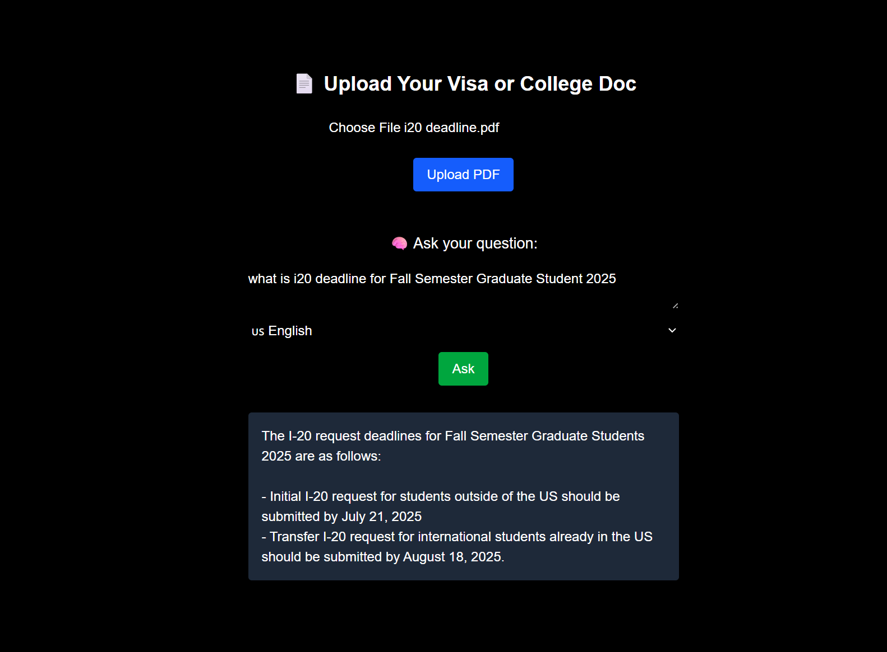

# StudyPath AI-Advisor 🧠📄  
**Multilingual GPT-4-Powered RAG System for International Students**

StudyPath is a multilingual Retrieval-Augmented Generation (RAG) system that helps international students navigate U.S. college admissions and visa policies. It supports scanned PDF documents like I-20s, extracts critical data via OCR, and uses GPT-4 to answer questions in natural language — all through a lightweight frontend. 🔄 Easily extensible to other document-heavy domains (e.g., immigration, healthcare, legal aid) with minimal changes.

---

## 💡 Features

✅ Upload scanned or digital PDFs (e.g., Form I-20, visa instructions, admission letters)  
🧠 Automatically chunk, embed, and index documents with `sentence-transformers` + FAISS  
🌍 Ask questions in English, Spanish, or Mandarin Chinese  
🧾 Combines personal document context with global policy knowledge  
💬 GPT-4 answers using hybrid document + background info  
🧼 Document management with soft & hard delete endpoints  
🧪 OCR fallback for scanned documents (via Tesseract)
---

## 🧱 Stack

**Frontend:**  
- React + Next.js  
- Tailwind CSS

**Backend:**  
- FastAPI  
- pdfplumber + pytesseract (OCR)  
- FAISS + Sentence-Transformers (MiniLM-L6-v2)  
- OpenAI API

